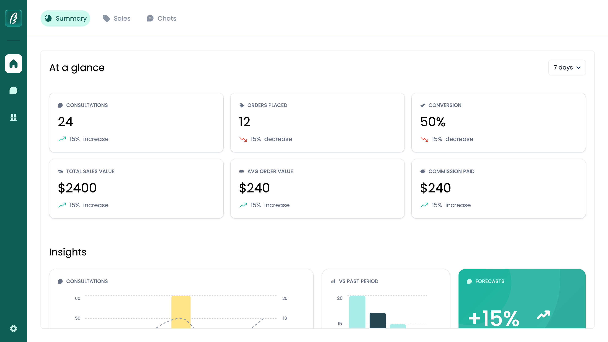
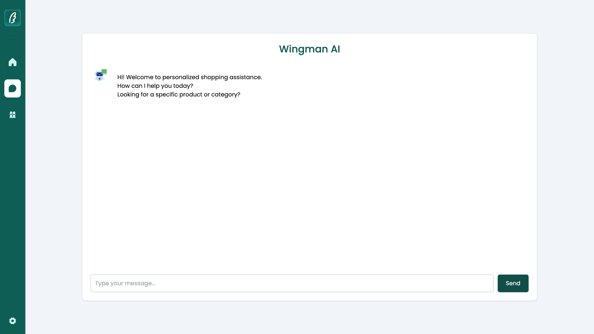
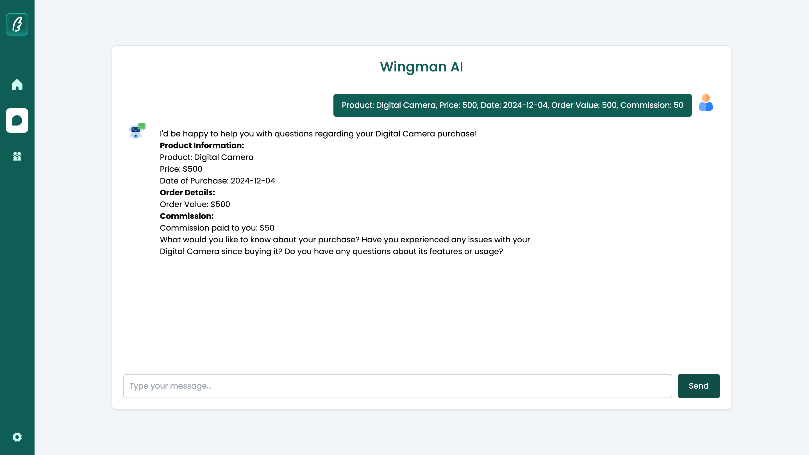

# 🤖 Chatbot Application

> 🌟 An intelligent shopping assistant that makes your online shopping experience more interactive and personalized!

## 📺 Demo Video

[](https://youtu.be/3XQ-zuWE00g?si=tUpgNEbGcm33xisF)

*Watch our chatbot in action! Click the image above to view the demo video.*

*Our sleek and intuitive chat interface*

---
## 🌐 Live Links

🔗 **Live Site**: [Try the Chatbot](https://assignment-wing.vercel.app/)

🎥 **Main Demo**: [Watch on YouTube](https://youtu.be/3XQ-zuWE00g?si=tUpgNEbGcm33xisF)

## ✨ Features

🗣️ **Interactive Chat Interface**
- Real-time conversation with advanced AI
- Natural language processing for better understanding
- Quick response times for seamless interaction


*Example of personalized product recommendations*

🎯 **Personalized Shopping Experience**
- Smart product recommendations
- Purchase history analysis
- Preference-based suggestions

🎨 **Modern Design**
- Fully responsive layout
- Dark/Light mode support
- Smooth animations

## 🛠️ Technologies Used

- ⚛️ React 18
- 🎨 CSS Modules
- 🔄 React Router
- 🌐 Fetch API
- 💅 Styled Components

## 📁 Project Structure

```
assignment_wing
├── 📂 /public
│   ├── 📄 index.html
│   └── 🎨 favicon.ico
├── 📂 /src
│   ├── 📂 /components
│   │   ├── 📂 /Chatbot
│   │   │   ├── 🎨 ChatBot.module.css
│   │   │   ├── 📄 InputForm.jsx
│   │   │   └── 📄 MessageList.jsx
│   │   └── 📂 /common
│   ├── 📂 /pages
│   │   └── 📄 Chat.jsx
│   ├── 📂 /hooks
│   ├── 📄 App.jsx
│   ├── 📄 index.js
│   └── 🎨 styles.css
├── 📄 .env
├── 📄 package.json
└── 📄 README.md
```

## 🚀 Getting Started

### Prerequisites

- Node.js 16+
- npm or yarn

### Installation

1. **Clone the repository:**
```bash
git clone https://github.com/yourusername/chatbot-app.git
```

2. **Navigate to project folder:**
```bash
cd chatbot-app
```

3. **Install dependencies:**
```bash
npm install
```

4. **Set up environment variables:**
Create a `.env` file:
```env
VITE_URL=your_api_url_here
```

5. **Start development server:**
```bash
npm run dev
```
*Quick and easy setup process*

## 💡 Usage

1. 🌐 Open your browser and navigate to `http://localhost:3000`
2. 💬 Start chatting with the bot
3. 🛍️ Get personalized shopping recommendations
4. ✨ Enjoy the smooth shopping experience!


*Example of a shopping conversation*

## 🤝 Contributing

We love your input! We want to make contributing as easy and transparent as possible:

1. 🍴 Fork the repo
2. 🔄 Create your branch (`git checkout -b feature/amazing`)
3. 💻 Make changes
4. ✅ Commit (`git commit -m 'Add amazing feature'`)
5. 🚀 Push (`git push origin feature/amazing`)
6. ✨ Open a Pull Request

## 📝 License

This project is licensed under the MIT License - see the [LICENSE](LICENSE) file for details.

---

Made with ❤️ by Jeevesh Rai
